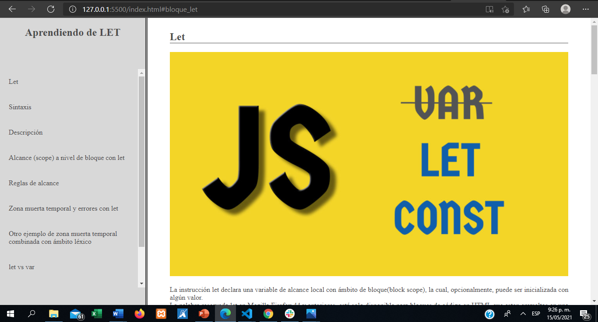
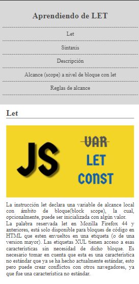

# 💎 Pagina Documentación

**Crea una nueva historia**      

Esta es una pagina que solo usa HTML y CSS, para dar un diseño adaptativo, pc > 1000px, Tablet >640px & <1000px, móvil <640px. Contiene una temática y es sobre “Let”.

Puedes verlo aquí: https://jacksonguerrer0.github.io/Pagina_Documentacion/index.html

## Requerimientos

Requiere un navegador y que se abra el archivo index.html

## 🔥 Instalación

## 🔍 Vistas 

### 💻 Desktop

### 📱 Mobile

## 📌 Stack

<escribe aquí>

## 🌟 Autor

* **Jackson Guerrero**  - [@jacksonguerrer0](https://github.com/jacksonguerrer0)

